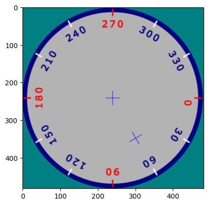
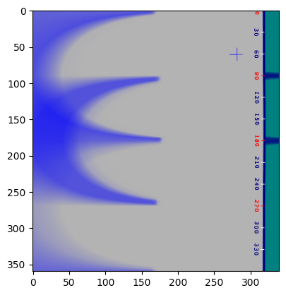
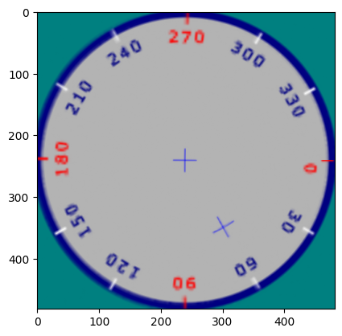

# LogPolar-PyTorch
Vectorized log-polar transformation of an image using PyTorch


```python
from functools import lru_cache
import torch, torchvision
import matplotlib.pyplot as plt
import numpy as np
import math
from torch_logpolar import LogPolarRepresentation


N=20
image = torchvision.io.read_image('public/clock.png')/255.
min_dim = min(image.shape[-2:])
image = image[..., :min_dim, :min_dim]
bimage = image.unsqueeze(0).expand(N,-1,-1,-1)
plt.imshow(bimage[0].moveaxis(0,-1))


```


    <matplotlib.image.AxesImage at 0x7fa221b558a0>


    

    


```python
logpol = LogPolarRepresentation(*bimage.shape[-2:])
bimageLogPol = logpol.cart2pol(bimage)
plt.imshow(bimageLogPol[0].moveaxis(0,-1))
bimageBis = logpol.pol2cart(bimageLogPol)
```


    

    


```python
plt.imshow(bimageBis[0].moveaxis(0,-1))
```


    <matplotlib.image.AxesImage at 0x7fa3136a9fc0>


    

    

